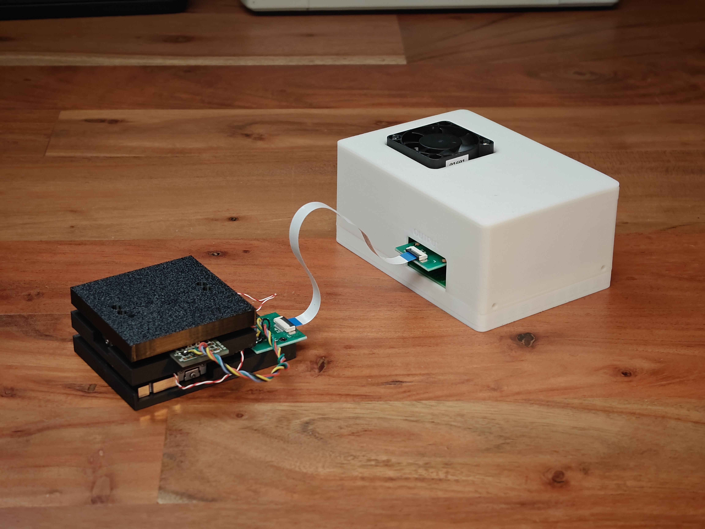
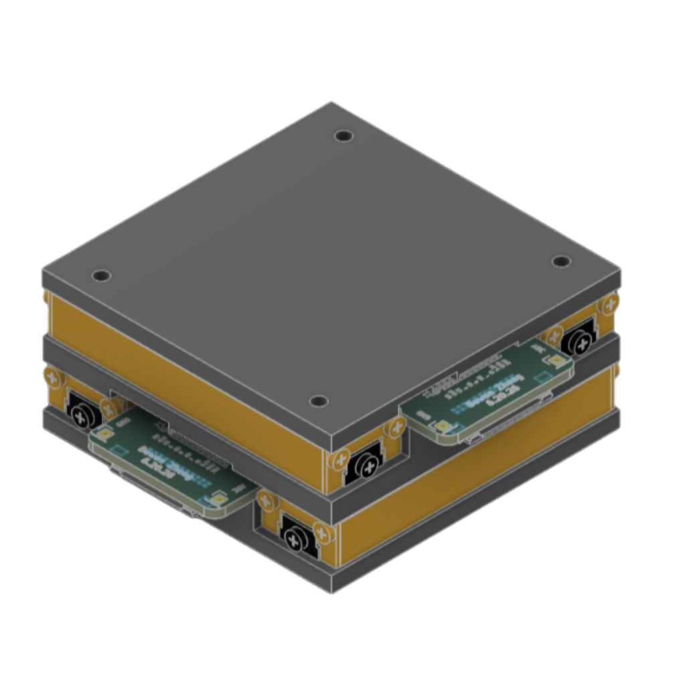
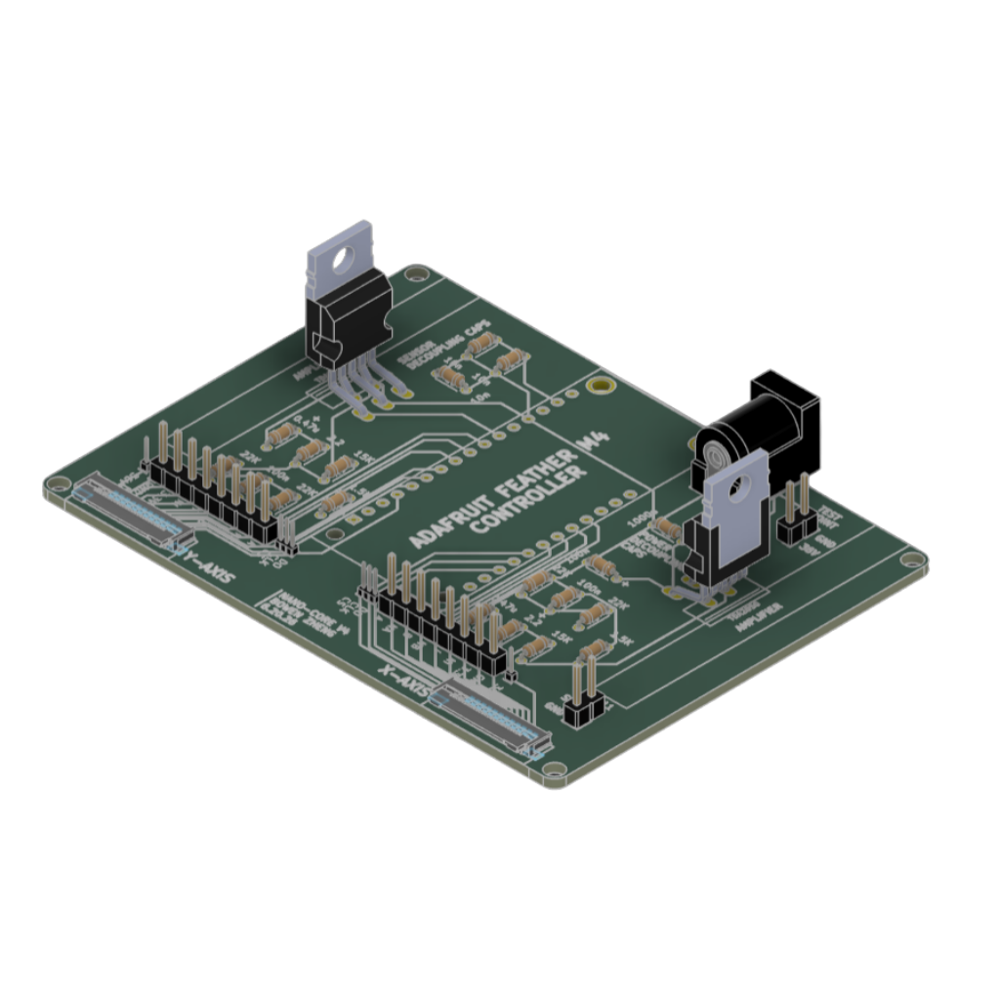
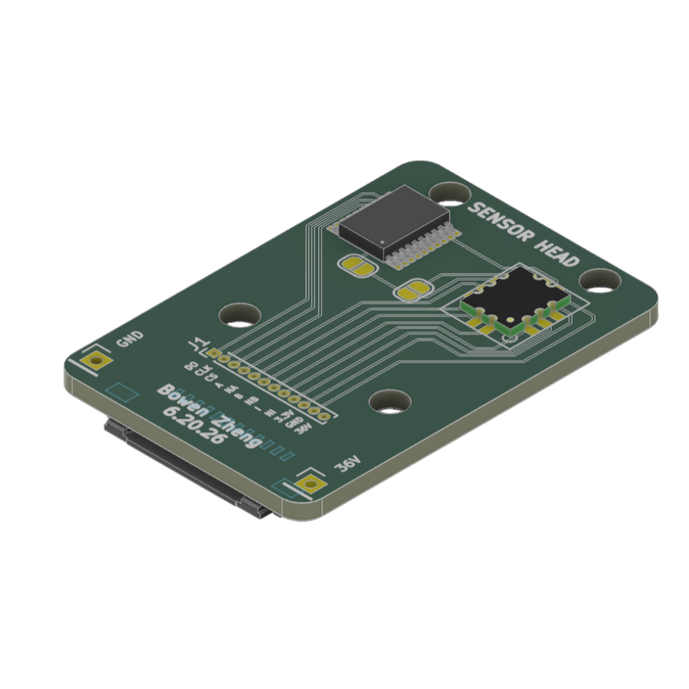

# Open Nano

This repository describes how to build and use your own nanopositioner. 

## Getting Started

1.  Go over this readme file for high-level overview
2.  Obtain the parts listed in the [Bill of Materials](https://github.com/bwnzhng/Open-Nano/blob/main/assembly/bom.md)
3.  Assemble the instrument and electronics
4.  Configure the hardware to fit your needs
5.  Upload firmware using VSCode with PlattformIO plugin
6.  Calibrate axis

## Design Files

Files (ie .stl and .dxf) for your reproduction are saved in [the assembly folder](https://github.com/bwnzhng/Open-Nano/tree/main/assembly/cad)

The CAD files are produced in Fusion360. You can get free access through the educational license. 

Otherwise, engineering drawings are attached for you to reproduce the part in your choice of CAD software as the designs are relatively straightforward.

## Electronics

The PCB schematics are designed in KICAD. No SMD soldering is required since through hole electronic components are used for easier hands-on assembly.

Please note you will need to attach heatsinks to the amplifiers to maintain optimal performance.

This repository also contains fabrication files that can directly uploaded to a PCB manufacturer (located in [the electronics folder](https://github.com/bwnzhng/Open-Nano/tree/main/electronics))

